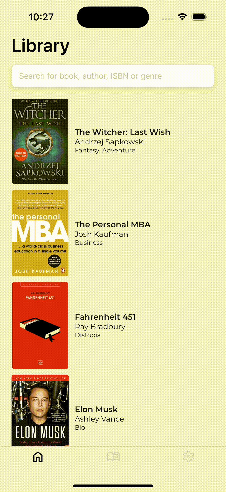
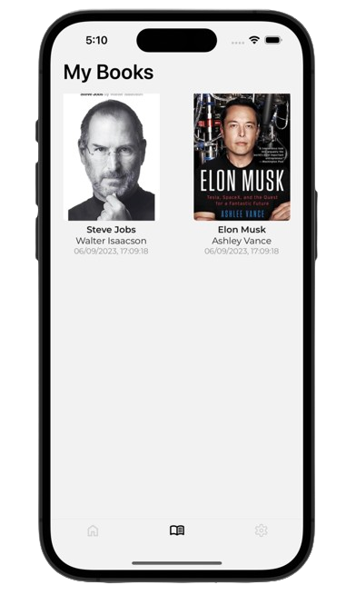

# Library App

A book library application built on React Native and Realm.

## Technologies

- <a href="https://reactnative.dev/">React Native</a> (v0.71.8)
- <a href="https://react.dev/">React</a> (v18.2.0)
- <a href="https://www.mongodb.com/docs/realm/sdk/react-native/">Realm</a> (v11.10.1)
- <a href="https://www.typescriptlang.org/">Typescript</a> (v4.9.4)
- <a href="https://expo.dev/">Expo CLI</a> (v48.0.18)
- <a href="https://redux-toolkit.js.org/">Redux Toolkit</a> (v1.9.5)
- <a href="https://github.com/software-mansion/react-native-gesture-handler">React Native Gesture Handler</a> (v2.9.0)
- <a href="https://github.com/software-mansion/react-native-screens">React Native Screens</a> (v3.20.0)
- <a href="https://github.com/software-mansion/react-native-svg">React Native SVG</a> (v13.4.0)
- <a href="https://www.npmjs.com/package/moment-timezone">Moment Timezone</a> (v0.5.43)
- <a href="https://jestjs.io/">Jest</a> (v29.2.1)

## Dependencies

- <a href="https://nodejs.org/en">Node.js 18.16.0 LTS</a>
- <a href="https://brew.sh/">Brew</a> (to install pods and watchman)
- <a href="https://www.ruby-lang.org/en/">Ruby</a> (optional, for pods)
- <a href="https://developer.android.com/studio">Android Studio</a> (to install SDKs and emulator)
- <a href="https://developer.apple.com/xcode/">Xcode</a> (to build iOS)
- <a href="https://www.oracle.com/tr/java/technologies/javase/jdk11-archive-downloads.html">Java Development Kit (JDK) 11</a>

## How To Run?

### On Emulator

- Run `$ npm install` to install dependencies.
- Then `$ npm run {ios | android}` to run application on specified platform.

### On Real Device

- Run `$ npm install` to install dependencies.
- Connect mobile device via `USB` and make sure `USB Debugging` is allowed on your phone.
- Then `$ npm run {ios | android} --localhost`

## Possible Problems and Solutions

### $ npm run android → android/gradlew exited with non-zero code: 1

Probably, you have a different version of JDK than expected. According to the <a href="https://reactnative.dev/docs/environment-setup?guide=native&platform=android">documentation</a>, the most compatible and suggested version is JDK11.

You can find the JDK11 installer by clicking <a href="https://www.oracle.com/tr/java/technologies/javase/jdk11-archive-downloads.html">here</a>.

### $ npm run android → Build failed: SDK location not found.

- Create a file named `local.properties` under `android/` folder in project.
- Set inside `sdk.dir = {YOUR_SDK_PATH}`
- Then run `$ npm run android`

## Registration

### As a Privileged User (aka: SU, Super User)

All you need to do is using an e-mail address that ends with `@protonmail.com`

### As a Regular User

Just sign up with an e-mail address that does not end with `@protonmail.com`

## Use Cases

### Case 1: Librarian

Consider that you are a librarian, you need to create entries of books.  

You should be able to:

- Access to full CRUD operations (create, read, update and delete) for books.
- Upload image.
- Take photograph.
- Change image of a book.
- Change any detail of book.
- Save changes.

Therefore, a basic case should be like:

- User signs up with an e-mail address that ends with `@protonmail.com` to be privileged user.
- User logs in.
- User swipes right to create a new book.  
  
- User takes a photograph of a book.
- User enters details of the book.
- User saves the book.
- User sees the book in home, and keep goes create new books.
- User swipes right again.
- User picks an book image from gallery.
- User enters details of the book.  
  `...`

### Case 2: Regular Library User

Consider that you are a user of a library application and you want to borrow some books.

You should be able to:

- Access book data.
- Borrow or put back books.

Therefore, a basic case should be like:

- User signs up with their personal information.
- User logs in and sees the books.
- User taps on a book that interested in.
- User taps on `Borrow` button.

## Screenshots

### Login

### Sign Up

### Sign Up (onChange)

### Sign Up (onSubmit)

### Home

### Details (w/ SU Privileges)

### My Books (Borrowed)

### Camera (Requires SU Privileges)

### Camera (onImagePick)

